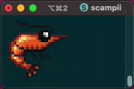
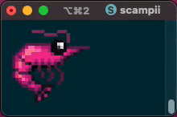

# scampii

An animated pixel-art shrimp for your terminal.

## Sample




```
                                  ░░
                  ░░░░░░░░░░        ░░
                ░░          ░░      ░░
                ░░            ░░░░░░
                ░░  ░░░░░░
                  ░░████░░░░▒▒▒▒▒▒▒▒▒▒▒▒▒▒▒▒
    ▒▒▒▒▒▒▒▒▒▒▒▒▒▒░░██▒▒░░░░▒▒▒▒▒▒▓▓▓▓████▒▒▒▒
        ░░▒▒▒▒▒▒▓▓░░░░░░░░░░▒▒▓▓▓▓██████████▒▒▒▒
            ░░▒▒▓▓▓▓░░░░░░▒▒▓▓▓▓▓▓▓▓▓▓▓▓████▓▓▒▒▒▒
                ░░▒▒▓▓▓▓▓▓▓▓▓▓▓▓▓▓▓▓▓▓▓▓▓▓▓▓██▒▒▒▒▒▒
                  ░░▒▒▓▓▒▒▓▓▒▒▓▓▒▒▓▓▒▒▓▓▓▓▓▓▒▒▓▓▒▒▒▒
                    ░░░░▒▒▓▓▒▒▓▓▒▒▓▓▒▒▓▓░░▒▒▓▓██▓▓▒▒
                  ░░    ░░░░░░░░░░░░░░░░▒▒▓▓▓▓██▓▓▒▒
                ░░      ░░    ░░  ░░  ░░▒▒▒▒▓▓▓▓▒▒
                      ░░    ░░    ░░    ░░░░▒▒▒▒▓▓▒▒
                      ░░    ░░        ░░▒▒▒▒▓▓██▓▓▒▒
                        ░░            ░░▒▒▓▓██▒▒▒▒
                                  ░░░░▒▒▒▒▒▒▒▒▒▒
                          ░░░░░░░░▒▒▒▒▓▓▒▒▒▒▒▒
                            ▓▓▒▒░░▒▒▒▒▒▒▒▒
                            ░░░░▒▒░░▒▒
                              ▓▓░░▒▒░░
                                ░░▓▓░░
                                    ░░
```

Pixel-perfect animated shrimp with auto-detecting terminal image protocols.
Falls back to Unicode half-blocks when no image protocol is available.

## Install

```bash
cargo install scampii
```

## Run

```bash
scampii              # classic orange
scampii ocean        # blue
scampii barbie       # hot pink
scampii ff00ff       # any hex color
scampii --scale 2    # smaller pixels
scampii -p halfblock # force character mode
```

Press any key to exit.

## Use as a library

The simplest API -- auto-detects protocol, manages frame cycling:

```rust
let mut anim = scampii::Animation::new(scampii::Theme::classic());
let mut out = std::io::stdout();

loop {
    anim.draw(&mut out).unwrap();
    std::thread::sleep(std::time::Duration::from_millis(100));
}
```

With options:

```rust
let mut anim = scampii::Animation::new(scampii::Theme::preset("ocean").unwrap())
    .scale(2)
    .protocol(scampii::Protocol::Halfblock);
```

Custom theme:

```rust
let mut anim = scampii::Animation::new(scampii::Theme::from_color(0xFF, 0x00, 0x99));
anim.theme_mut().set_color(scampii::Hue::Antenna, 0xFF, 0x80, 0xCC);
```

For lower-level control, use `Renderer`, `ItermRenderer`, `KittyRenderer`, or
`SixelRenderer` directly. See the [examples/](examples/) directory.

## Terminals

| Protocol  | Terminals                        |
| --------- | -------------------------------- |
| iTerm2    | iTerm2, WezTerm, VS Code, Cursor |
| Kitty     | Kitty, Ghostty                   |
| Sixel     | foot, mlterm, xterm              |
| Halfblock | Everything else                  |

Auto-detected. Override with `--protocol` or `.protocol()`.

## Themes

| Name       | Hex       |
| ---------- | --------- |
| `classic`  | `#E8732A` |
| `ocean`    | `#2090DD` |
| `forest`   | `#30A840` |
| `neon`     | `#FF00FF` |
| `gold`     | `#FFB43C` |
| `ice`      | `#88CCFF` |
| `lava`     | `#FF3300` |
| `midnight` | `#663399` |
| `barbie`   | `#E0218A` |

Or pass any hex color: `scampii c0ffee`

## Environment

| Variable        | Effect                 |
| --------------- | ---------------------- |
| `SCAMPII_COLOR` | Default color/theme    |

## Requirements

- Rust 1.74+
- True-color terminal (24-bit)
- macOS or Linux

## Contributing

See [CONTRIBUTING.md](CONTRIBUTING.md).

## License

MIT OR Apache-2.0
